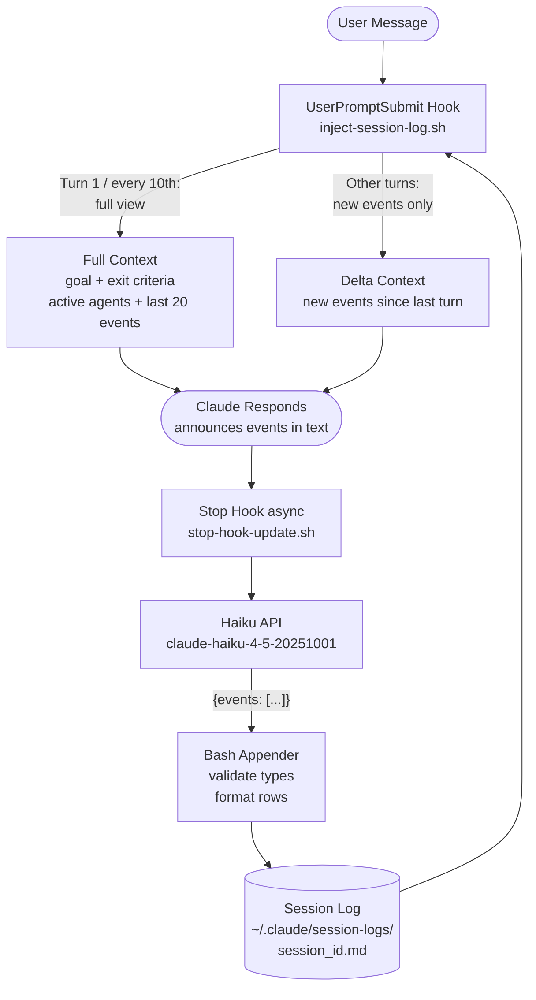
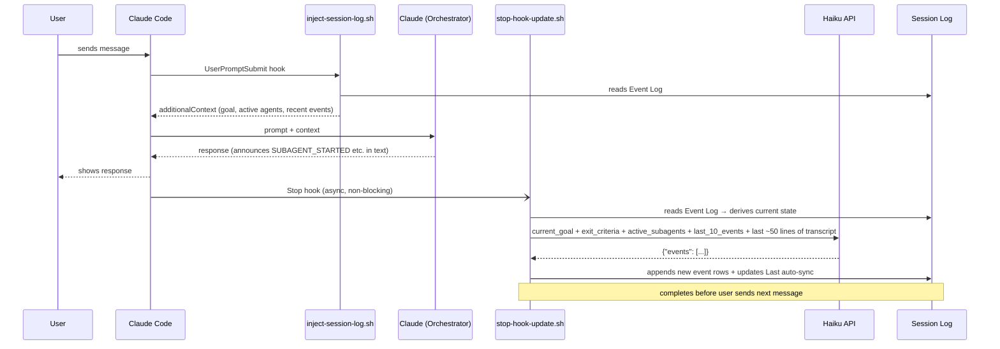
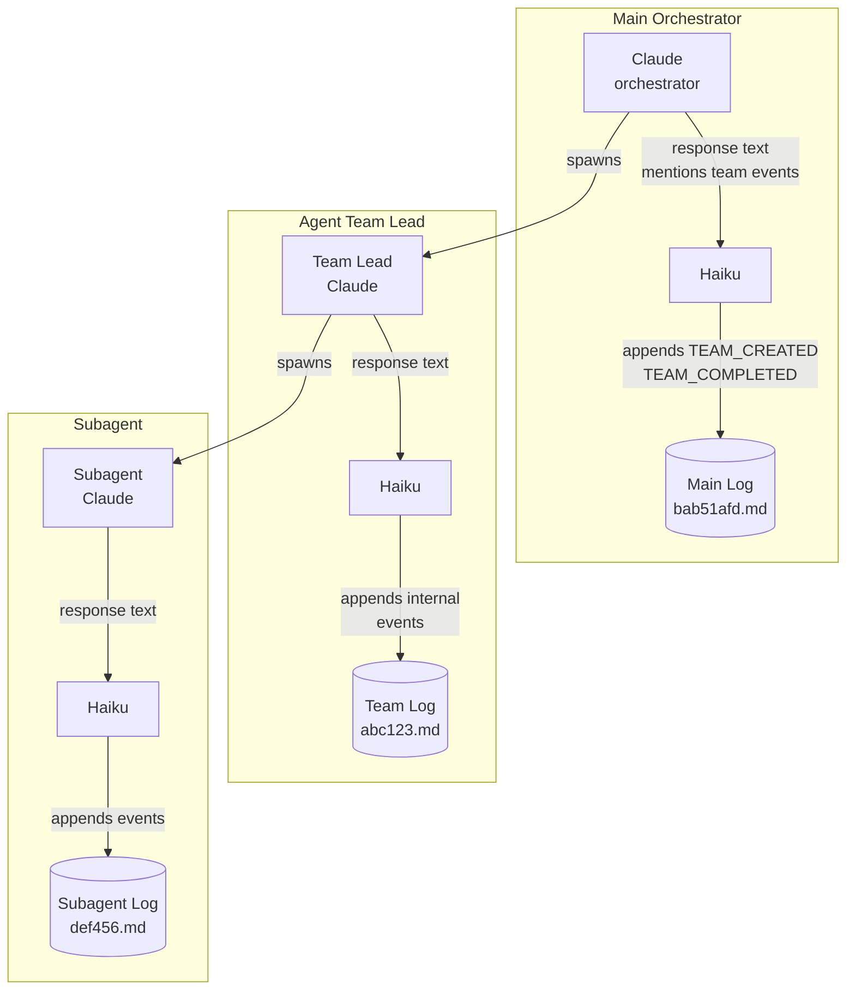

# Claude Session Management System

A lightweight system that gives Claude Code sessions persistent memory, structured state tracking, and context-aware orientation across long conversations and restarts.

---

## Why This Exists

Claude Code sessions lose context over time — through autocompaction, long conversations, and restarts. The orchestrator model (defined in `CLAUDE.md`) coordinates subagents and teams, but needs to know what it was doing, what's in flight, and what the current goal is at any point in the session.

This system solves that by maintaining a structured, append-only event log per session, injecting the right amount of context at the right times, and automating log maintenance via a background Haiku model.

---

## Installation

1. **Copy scripts** to `~/.claude/`:
   ```bash
   cp claude/session-start-hook.sh claude/inject-session-log.sh claude/stop-hook-update.sh ~/.claude/
   chmod +x ~/.claude/*.sh
   ```

2. **Install `cf`** fork command:
   ```bash
   cp claude/cf ~/.local/bin/cf
   chmod +x ~/.local/bin/cf
   # Ensure ~/.local/bin is on your PATH
   ```

3. **Configure settings**:
   ```bash
   cp claude/settings.template.json ~/.claude/settings.json
   # Edit ~/.claude/settings.json and replace YOUR_API_KEY_HERE with your Anthropic API key
   ```

4. **Install CLAUDE.md**:
   ```bash
   cp claude/CLAUDE.md ~/.claude/CLAUDE.md
   ```

5. **Dependencies**: `jq`, `curl`, `bash 4+`. On macOS: `brew install jq`.

**Note**: The `ANTHROPIC_API_KEY` in `settings.json` is used by the background Haiku sync process — it's separate from the key Claude Code itself uses for the main session.

---

## Architecture



```
SessionStart
  └── session-start-hook.sh
        Creates log file if new session; injects minimal pointer to log path

Each User Turn
  └── inject-session-log.sh  (UserPromptSubmit hook)
        Reads event log → derives current state → injects context into Claude's turn
        • Turn 1 + every 10 turns: full view (goal, exit criteria, active agents, last 20 events)
        • All other turns: delta only (new events since last injection, or silent if nothing new)
        State tracked in /tmp/session-log-inject-<id>.turn and .state files

Claude Responds
  └── Claude announces events in response text:
        "SUBAGENT_STARTED id=abc123 name=foo task=..."
        "GOAL_SET: do the thing | Exit: criteria here"
        Haiku reads these and appends structured events to the log.

Turn Ends
  └── stop-hook-update.sh  (Stop hook, async: true)
        Derives session log path from session_id in stdin JSON (never from env var)
        Reads last ~200 lines of transcript JSONL → extracts last ~50 message lines → derives structured state from Event Log
        Passes to Haiku: current_goal, exit_criteria, active_subagents, last_10_events
        Haiku returns {"events": [...]} JSON
        Bash script validates types and appends formatted rows to Event Log
        Updates "Last auto-sync" timestamp
        Runs in background — zero latency impact
```

## Sequence



### Per-Instance Session Log Isolation

Each Claude Code instance — the main orchestrator, team leads, and subagents — has its own session ID and its own isolated session log. The stop hook always derives the log path from `session_id` in the stdin JSON, not from the `SESSION_LOG_PATH` env var (which was collision-prone across instances sharing an environment).



**Team leads** are separate Claude Code instances with their own session IDs. Their Stop hook fires after each response, so Haiku populates their own session log tracking internal work. The main orchestrator's session log sees only TEAM_CREATED / TEAM_COMPLETED events — it does not see the team's internal activity.

---

## Session Log Format

One file per session at `~/.claude/session-logs/<session_id>.md`:

```markdown
# Session: <name>
- Session ID: <id>
- Created: <timestamp>
- Directory: <working dir>
- Last auto-sync: <timestamp>

## Event Log
| Time  | Type               | Details                                              |
|-------|--------------------|------------------------------------------------------|
| 09:12 | GOAL_SET           | Build the thing | Exit: tests pass, deployed          |
| 09:13 | SUBAGENT_STARTED   | id=abc name=researcher task="find the API endpoint"  |
| 09:14 | SUBAGENT_COMPLETED | id=abc outcome="found it: /api/v2/users"             |
| 09:15 | NOTE               | Rate limit hit on first attempt, retried after 2s    |
```

The log is **append-only**. No rows are ever edited or deleted. Active state (current goal, active subagents/teams) is derived at read time by the inject hook.

### Event Types

| Type | Who emits | Purpose |
|------|-----------|---------|
| `GOAL_SET` | User → Haiku | New goal or pivot. Includes exit criteria. |
| `SESSION_RENAMED` | User → Haiku | Session name update. |
| `SUBAGENT_STARTED` | Claude announces → Haiku | Background agent spawned. |
| `SUBAGENT_UPDATED` | Claude announces → Haiku | Mid-flight status update. |
| `SUBAGENT_COMPLETED` | Claude announces → Haiku | Agent finished, outcome recorded. |
| `TEAM_CREATED` | Claude announces → Haiku | Agent team created. |
| `TEAM_UPDATED` | Claude announces → Haiku | Team status update. |
| `TEAM_COMPLETED` | Claude announces → Haiku | Team disbanded, outcome recorded. |
| `NOTE` | Haiku | Significant facts that don't fit other types. |

**Rule**: `GOAL_SET` and `SESSION_RENAMED` only fire when the **user** explicitly sets a goal or renames. Never inferred from what the assistant says it's doing.

---

## Files

| File | Purpose |
|------|---------|
| `CLAUDE.md` | Claude's operating instructions (orchestrator identity, rules, event vocabulary) |
| `README.md` | This file — human reference |
| `session-start-hook.sh` | Creates log, injects log path on session start |
| `inject-session-log.sh` | Derives + injects context on each user turn (delta-aware) |
| `stop-hook-update.sh` | Async Haiku call after each turn; appends events to log |
| `session-logs/<id>.md` | Per-session event log |
| `settings.json` | Hook registrations + env config |

### Temporary state files (in /tmp)
- `session-log-inject-<id>.turn` — turn counter for full vs delta view
- `session-log-inject-<id>.state` — last event count shown to Claude
- `session-log-update-<id>.lock` — prevents concurrent Haiku updates

---

## Context Injection Strategy

| When | What Claude sees |
|------|-----------------|
| Session start | Path to log + "you are the orchestrator" reminder |
| Turn 1 | Full view: goal, exit criteria, active subagents/teams, last 20 events |
| Turns 2–9, 11–19, etc. | Delta: only new events since last turn (silent if nothing new) |
| Every 10th turn | Full view again (re-orientation reminder) |

This prevents the same context from accumulating identically across every turn in the conversation history.

---

## Haiku Integration

The background Haiku call (`claude-haiku-4-5-20251001`) runs after each Claude turn:
- Derives structured state from the Event Log: current goal, exit criteria, active subagents, last 10 events
- Reads the last ~200 lines of the transcript JSONL, extracts user/assistant turns, and passes the last ~50 message lines (up to 6000 chars) to Haiku
- Passes derived state + recent conversation to Haiku (same view Claude gets)
- Returns structured JSON: `{"events": [{"type": "...", ...}, ...]}`
- The bash script validates types against the enum and appends formatted rows

Haiku's system prompt includes the full CLAUDE.md for context (prompt-cached across turns). It understands the orchestrator model and knows only to emit events for things that actually happened. Because Haiku sees what's already in `last_10_events`, it can self-correct missing events from prior turns and skip duplicates contextually.

The Haiku update may lag 1–2 turns — this is noted in the injected context so Claude doesn't assume the log is fully current.

---

## Subagent Management

- **To stop a running agent**: `TaskStop` first, then optionally resume with new instructions
- **To update a mid-flight agent**: `TaskStop` → `Agent` with `resume` parameter and updated prompt
- **Never** spawn a replacement without stopping the original first
- **Never** kill the underlying process a subagent is monitoring without also stopping the subagent — it will otherwise keep polling a dead process or try to restart it

---

## cf — Fork Command

`cf` (`~/.local/bin/cf`) forks the current Claude session into a new terminal window with fresh context. Use `cf "question"` to ask a quick question without cluttering the main session.

The `UserPromptSubmit` hook intercepts prompts starting with `cf ` or `!cf ` and blocks them from reaching the main Claude session, launching `cf` as a side effect instead.

---

## Key Design Decisions

**Why append-only?** Prevents any single update from corrupting or overwriting history. Active state is always re-derivable from the log.

**Why Haiku instead of Claude updating the log?** Claude is expensive and the main orchestrator shouldn't be interrupted by bookkeeping. Haiku is fast, cheap, and runs async with zero turn latency.

**Why not have Claude write to the log directly?** Tried it — Claude used `Write` (overwrite) instead of `Edit` (append) and destroyed session history. The async Haiku approach removes this failure mode entirely.

**Why delta injection?** Full context injected every turn accumulates identically in the conversation history, wasting context budget. Delta injection is proportional to actual activity.

**Why not plan in the main context?** A plan created in the orchestrator's context gets injected back every turn via the session log, polluting the main context window. When planning is needed, an agent team owns the plan — one member plans, another reviews, they spawn subsequent subagents themselves. The orchestrator only sees the final outcome.
